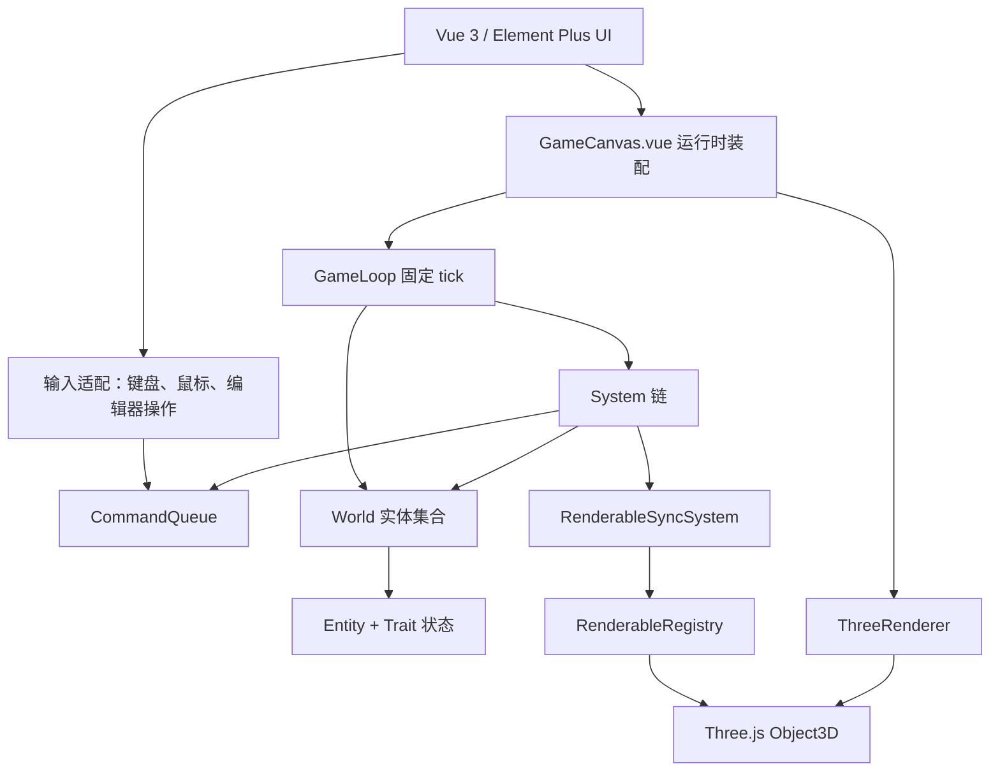
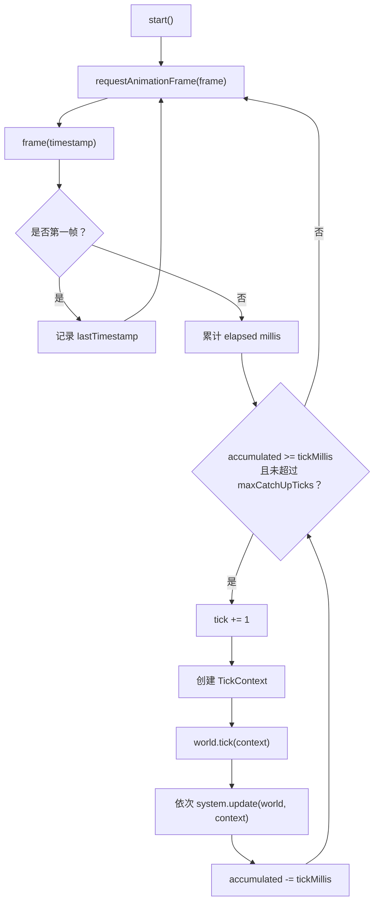
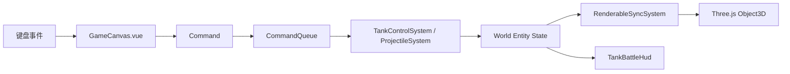
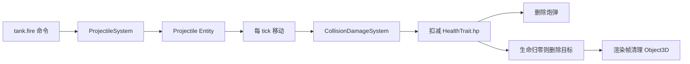

# 游戏引擎设计文档

## 1. 文档目标

本文说明当前游戏引擎的设计思路、核心架构、代码逻辑和后续扩展方向。它不是单纯的功能清单，而是给后续开发者看的工程设计说明：为什么这样拆分模块、每个模块负责什么、运行时如何流转、扩展时应该遵守哪些边界。

当前项目使用 `Vue 3 + Element Plus + Vite + TypeScript + Three.js` 技术栈。短期目标是用 `3D 坦克大战` 验证引擎框架，长期目标是逐步扩展到红色警戒风格的 RTS 沙盒。

## 2. 总体设计思路

### 2.1 先做可验证的小引擎，而不是直接复刻完整 RTS

红色警戒类 RTS 涉及单位、地图、寻路、战争迷雾、建造、资源、AI、联网、编辑器等大量系统。如果一开始直接做完整 RTS，架构很容易被临时玩法需求拉乱。

因此本项目采用分阶段验证：

1. 先做引擎最小骨架：固定 tick、World、Entity、Trait、System、Command、渲染适配。
2. 再做 3D 坦克大战：验证移动、开火、碰撞、伤害、HUD 和 Three.js 场景同步。
3. 再做人机对战：验证 AI、阵营、胜负条件。
4. 再做地图 JSON 和关卡编辑器：验证内容生产链路。
5. 最后扩展 RTS 操作层：框选、多单位命令、寻路、生产、资源和战争迷雾。

这个路径的核心价值是：每一阶段都能运行、能测试、能暴露架构问题。

### 2.2 核心模拟层与渲染层分离

游戏规则不依赖 Three.js。核心模拟层只认识这些概念：

- 实体 id
- 实体类型
- 位置、旋转、缩放
- Trait 状态
- 命令
- 系统
- tick 时间

Three.js 只出现在渲染适配层和具体玩法的 render 工厂中。这样做有几个原因：

- 核心逻辑可以在 Vitest 中独立测试，不需要浏览器和 WebGL。
- 后续可以做回放、AI 批量模拟、服务端模拟或确定性校验。
- 渲染表现可以替换，例如从简单几何体换成 glTF 模型，不影响玩法系统。
- Vue 页面不会和游戏规则互相污染。

### 2.3 用固定 tick 保证模拟稳定

浏览器 `requestAnimationFrame` 的帧率不稳定。它可能是 60 FPS，也可能因为系统负载、后台标签页、GPU 性能而变化。

如果游戏逻辑直接按渲染帧推进，会出现：

- 不同机器上移动速度不一致。
- AI、冷却、碰撞行为不稳定。
- 很难做回放和同步。

因此 `GameLoop` 使用固定 tick 推进模拟。当前默认是 `30 tick/s`，每个 tick 的 `deltaSeconds` 固定为 `1 / 30`。

### 2.4 用命令表达输入意图

玩家按键、AI 决策、回放脚本和未来网络同步都不应该直接修改实体状态，而是写入命令队列。

例如按下空格不是直接创建炮弹，而是写入：

```ts
{
  id: 'fire-1',
  actorId: 'player',
  type: 'tank.fire',
  payload: { requestId: 'shot-1' },
}
```

随后 `ProjectileSystem` 在固定 tick 中消费这个命令，再根据武器冷却、炮弹参数和发射者 transform 创建炮弹实体。

这种设计让所有输入来源走同一条路径，后续做 AI、回放、联机时不用重写玩法系统。

### 2.5 用 Entity + Trait + System 组合玩法能力

本项目没有把 `Tank`、`Projectile`、`Target` 写成继承层级，而是采用组合模型：

- `Entity` 是一个轻量容器。
- `Trait` 保存实体能力和状态。
- `System` 处理跨实体规则。

例如玩家坦克是一个实体，它拥有：

- `TankTrait`
- `WeaponTrait`
- `HealthTrait`
- `ColliderTrait`

炮弹也是实体，它拥有：

- `ProjectileTrait`
- `ColliderTrait`

目标也是实体，它拥有：

- `HealthTrait`
- `ColliderTrait`

系统只关心某些 Trait 是否存在，而不是依赖复杂继承关系。后续要做“可移动建筑”“带武器的炮塔”“可被摧毁的墙体”，都可以通过组合 Trait 实现。

## 3. 架构分层



### 3.1 应用层：`src/app`

应用层负责页面和运行时装配。

关键文件：

- `src/app/App.vue`：应用框架和导航。
- `src/app/router/index.ts`：路由。
- `src/app/views/GameView.vue`：游戏页面。
- `src/app/views/EditorView.vue`：编辑器占位页面。
- `src/app/components/GameCanvas.vue`：当前游戏运行时入口。

`GameCanvas.vue` 当前负责：

1. 创建 `World`。
2. 创建 `CommandQueue`。
3. 创建 `RenderableRegistry`。
4. 创建 `ThreeRenderer`。
5. 注册坦克大战系统链。
6. 监听键盘输入，把输入写入命令队列。
7. 每帧补齐或清理 Three.js 渲染对象。
8. 更新 HUD 状态。

### 3.2 核心引擎层：`src/engine`

核心层不依赖 Vue，也不依赖 Three.js。

关键职责：

- 管理固定 tick。
- 管理实体生命周期。
- 定义实体、Trait、System、Command。
- 提供事件总线。
- 支持纯逻辑测试。

目录：

```text
src/engine/
  command/
    Command.ts
    CommandQueue.ts
  core/
    GameLoop.ts
    System.ts
    TickContext.ts
    World.ts
  entity/
    Entity.ts
    EntityId.ts
    Trait.ts
    Transform.ts
  event/
    EventBus.ts
```

### 3.3 Three.js 适配层：`src/engine-three`

Three.js 适配层负责把核心模拟状态显示出来。

关键职责：

- 初始化 Three.js 场景、相机、光照、渲染器。
- 管理 `EntityId -> Object3D` 映射。
- 将实体 transform 同步到 Three.js 对象。

目录：

```text
src/engine-three/
  renderer/
    ThreeRenderer.ts
    RenderableRegistry.ts
    RenderableSyncSystem.ts
```

### 3.4 玩法层：`src/games/tank-battle`

玩法层基于核心引擎实现具体游戏。

目录：

```text
src/games/tank-battle/
  commands/
    TankCommands.ts
  factory/
    createTankBattleWorld.ts
  render/
    createTankBattleRenderables.ts
  systems/
    TankControlSystem.ts
    ProjectileSystem.ts
    CollisionDamageSystem.ts
  traits/
    TankTrait.ts
    WeaponTrait.ts
    HealthTrait.ts
    ColliderTrait.ts
    ProjectileTrait.ts
  ui/
    TankBattleHud.vue
  utils/
    traitLookup.ts
```

玩法层可以依赖 `src/engine` 和 `src/engine-three`，但要保持职责清楚：

- `traits/` 保存玩法状态。
- `systems/` 修改模拟状态。
- `render/` 创建视觉对象。
- `ui/` 显示状态，不写核心规则。
- `factory/` 创建当前测试场景。

## 4. 核心代码逻辑

### 4.1 `GameLoop`：固定 tick 主循环

文件：`src/engine/core/GameLoop.ts`

`GameLoop` 是当前引擎的时间驱动核心。它把浏览器的 animation frame 转换成固定 tick。

核心状态：

```ts
private readonly tickMillis: number
private running = false
private frameHandle: number | undefined
private lastTimestamp: number | undefined
private accumulatedMillis = 0
private tick = 0
```

核心流程：



关键设计点：

- `tickRate` 控制每秒模拟次数。
- `maxCatchUpTicks` 限制卡顿后一次补跑的最大 tick 数，避免页面恢复时长时间卡死。
- 测试可以注入 `requestFrame` 和 `cancelFrame`，手动控制时间。
- 默认浏览器调度器使用 `globalThis.requestAnimationFrame.bind(globalThis)`，避免原生方法调用者错误导致 `Illegal invocation`。

每个 tick 内部顺序：

1. `world.tick(context)` 先调用 Trait 自身 tick 钩子。
2. 再依次执行系统列表。

这意味着：

- Trait 适合处理实体内部简单生命周期。
- System 适合处理跨实体逻辑，例如碰撞、伤害、AI、命令消费。

### 4.2 `World`：实体集合与生命周期

文件：`src/engine/core/World.ts`

`World` 是模拟层的实体容器。它内部使用 `Map<EntityId, Entity>` 保存实体。

核心接口：

```ts
spawn(entity: Entity): void
remove(id: EntityId): Entity
has(id: EntityId): boolean
get(id: EntityId): Entity
getAll(): Entity[]
tick(context: TickContext): void
```

`spawn` 逻辑：

1. 检查 id 是否重复。
2. 写入实体 Map。
3. 调用每个 Trait 的 `onAttach` 钩子。

`remove` 逻辑：

1. 检查实体是否存在。
2. 调用每个 Trait 的 `onDispose` 钩子。
3. 从 Map 删除实体。
4. 返回被删除实体。

`tick` 逻辑：

1. 遍历所有实体。
2. 遍历实体所有 Trait。
3. 如果 Trait 有 `onTick`，则调用。

设计约束：

- `World` 不知道坦克、炮弹、AI、渲染对象这些具体概念。
- `World` 只管理实体生命周期，不处理玩法规则。
- 重复 id 和不存在实体都直接抛错，因为这是程序错误，不应静默吞掉。

### 4.3 `Entity` 与 `Transform`

文件：

- `src/engine/entity/Entity.ts`
- `src/engine/entity/Transform.ts`

实体结构：

```ts
export interface Entity {
  id: EntityId
  type: string
  transform: Transform
  traits: Trait[]
}
```

Transform 结构：

```ts
export interface Transform {
  position: Vector3Like
  rotation: Vector3Like
  scale: Vector3Like
}
```

这里刻意没有使用 `THREE.Vector3`，原因是核心模拟层不应该依赖 Three.js。`RenderableSyncSystem` 会把这个普通对象转换到 Three.js `Object3D`。

### 4.4 `Trait`：实体能力与状态片段

文件：`src/engine/entity/Trait.ts`

Trait 是实体状态和能力的基本单元。当前玩法中使用的 Trait 包括：

- `TankTrait`
- `WeaponTrait`
- `HealthTrait`
- `ColliderTrait`
- `ProjectileTrait`

Trait 可以提供生命周期钩子：

```ts
onAttach?(entity: Entity): void
onTick?(entity: Entity, context: TickContext): void
onDispose?(entity: Entity): void
```

当前坦克大战主要通过 System 处理行为，Trait 主要保存状态。后续如果有粒子生命周期、持续 buff、临时状态，也可以用 `onTick` 做局部更新。

### 4.5 `System`：跨实体规则

文件：`src/engine/core/System.ts`

System 接口很小：

```ts
export interface System {
  readonly name: string
  update(world: World, context: TickContext): void
}
```

这样设计的好处：

- 系统容易测试。
- 系统执行顺序由运行时装配决定。
- 每个系统可以只关注一种规则。
- 后续可以加入调试面板，显示每个系统耗时。

当前 `GameCanvas.vue` 的系统顺序是：

```ts
[
  new TankControlSystem(commands),
  new ProjectileSystem(commands),
  new CollisionDamageSystem(),
  new RenderableSyncSystem(registry),
]
```

顺序含义：

1. 先处理玩家移动。
2. 再处理开火和炮弹推进。
3. 再处理炮弹碰撞和伤害。
4. 最后同步渲染对象。

如果未来增加 AI，通常放在 `TankControlSystem` 之前或作为命令生产系统，让 AI 先写入命令，再由控制系统统一执行。

### 4.6 `CommandQueue`：命令缓存与按系统消费

文件：`src/engine/command/CommandQueue.ts`

命令结构：

```ts
export interface Command<TPayload = unknown> {
  id: string
  actorId: EntityId
  type: string
  payload: TPayload
  tick?: number
}
```

队列核心方法：

```ts
enqueue(command: Command): void
dequeueForTick(
  currentTick: number,
  predicate: (command: Command) => boolean = () => true,
): Command[]
size(): number
```

`dequeueForTick` 的逻辑：

1. 遍历队列中的所有命令。
2. 判断命令是否已经到达可执行 tick。
3. 判断命令是否满足当前系统的 predicate。
4. 满足则放入 ready。
5. 不满足则留在 pending。
6. 用 pending 覆盖原队列。
7. 返回 ready。

关键点是 predicate。没有 predicate 时，一个系统会拿走所有到期命令，导致后面的系统收不到自己的命令。现在每个系统只消费自己认识的命令类型。

例如 `ProjectileSystem` 只消费 `tank.fire`：

```ts
for (const command of this.commands.dequeueForTick(
  context.tick,
  (queuedCommand) => queuedCommand.type === 'tank.fire',
)) {
  // 处理开火
}
```

### 4.7 `EventBus`：解耦通信

文件：`src/engine/event/EventBus.ts`

EventBus 用于后续系统间通信和 UI 通知。当前 Phase 2 的主要逻辑还没有大量使用事件，但保留这个基础设施是为了后续：

- 实体受伤事件。
- 实体死亡事件。
- 胜负事件。
- 关卡加载事件。
- 编辑器保存/校验事件。
- 调试面板统计事件。

EventBus 不应该替代命令。命令表达“我要做什么”，事件表达“已经发生了什么”。

## 5. 坦克大战核心逻辑

### 5.1 世界创建

文件：`src/games/tank-battle/factory/createTankBattleWorld.ts`

当前世界工厂创建：

- 一个玩家坦克：`player`
- 三个目标：`target-1`、`target-2`、`target-3`

玩家坦克拥有：

```ts
[
  createTankTrait(),
  createWeaponTrait(),
  createHealthTrait(100),
  createColliderTrait(0.6),
]
```

目标拥有：

```ts
[
  createHealthTrait(50),
  createColliderTrait(0.8),
]
```

这是临时硬编码场景。后续 Level JSON 和地图编辑器完成后，世界工厂会被关卡运行时构建器替换。

### 5.2 输入到移动

文件：

- `src/app/components/GameCanvas.vue`
- `src/games/tank-battle/systems/TankControlSystem.ts`

输入流程：

1. Vue 监听 `keydown` / `keyup`。
2. `W/S` 计算 move 轴。
3. `A/D` 计算 turn 轴。
4. 写入 `tank.move` 命令。
5. `TankControlSystem` 在固定 tick 中消费命令。
6. 系统把输入保存到 `TankTrait.moveInput` 和 `TankTrait.turnInput`。
7. 每 tick 按速度和 deltaSeconds 更新实体 transform。

移动公式：

```ts
entity.transform.rotation.y += tank.turnInput * tank.turnSpeed * context.deltaSeconds
entity.transform.position.x +=
  Math.sin(entity.transform.rotation.y) * tank.moveInput * tank.moveSpeed * context.deltaSeconds
entity.transform.position.z +=
  Math.cos(entity.transform.rotation.y) * tank.moveInput * tank.moveSpeed * context.deltaSeconds
```

这里使用 `rotation.y` 作为水平朝向，`x/z` 作为地面平面坐标。

### 5.3 开火与炮弹

文件：`src/games/tank-battle/systems/ProjectileSystem.ts`

开火流程：

1. Vue 捕获 `Space`。
2. 写入 `tank.fire` 命令。
3. `ProjectileSystem` 消费命令。
4. 系统读取发射者 `WeaponTrait`。
5. 如果武器还在冷却，则忽略命令。
6. 如果可以开火，则复制发射者 transform 创建炮弹实体。
7. 设置武器冷却。

炮弹实体拥有：

```ts
[
  createProjectileTrait(shooter.id, weapon.projectileDamage, weapon.projectileSpeed),
  createColliderTrait(0.2, false),
]
```

炮弹每 tick 会：

1. 沿自身 `rotation.y` 方向移动。
2. `lifetimeTicks -= 1`。
3. 生命周期归零后从 World 删除。

### 5.4 碰撞、伤害与死亡

文件：`src/games/tank-battle/systems/CollisionDamageSystem.ts`

当前碰撞使用 XZ 平面的圆形碰撞。它不是最终物理方案，但足够验证 MVP 战斗闭环。

命中判断：

```ts
const radius = projectileCollider.radius + targetCollider.radius
const hit = distanceSquared(projectileX, projectileZ, targetX, targetZ) <= radius * radius
```

命中后：

1. 目标 `health.hp -= projectile.damage`。
2. 删除炮弹。
3. 如果目标生命值小于等于 0，标记 `destroyed = true` 并删除目标。
4. 一枚炮弹只处理第一次命中，避免同 tick 穿透多个目标。

碰撞系统会跳过：

- 炮弹自己。
- 炮弹发射者。
- 没有 `HealthTrait` 的实体。
- 没有 `ColliderTrait` 的实体。

### 5.5 渲染对象同步

文件：

- `src/games/tank-battle/render/createTankBattleRenderables.ts`
- `src/engine-three/renderer/RenderableSyncSystem.ts`

渲染同步分两步：

1. `createTankBattleRenderables` 保证每个实体都有对应 Object3D，并清理已删除实体的 Object3D。
2. `RenderableSyncSystem` 把实体 transform 同步到 Object3D。

为什么创建对象不放在 `RenderableSyncSystem` 中：

- 创建不同玩法对象需要知道实体类型和具体 Mesh 结构。
- `RenderableSyncSystem` 应该保持通用，只负责 transform 同步。
- 以后不同游戏可以有自己的 render 工厂，但共用同步系统。

## 6. 运行时装配逻辑

当前运行时入口是 `GameCanvas.vue`。

核心装配伪代码：

```ts
world = createTankBattleWorld()
commands = new CommandQueue()
registry = new RenderableRegistry()
renderer = new ThreeRenderer(host.value)

createTankBattleRenderables(world, registry, renderer)

loop = new GameLoop(
  world,
  [
    new TankControlSystem(commands),
    new ProjectileSystem(commands),
    new CollisionDamageSystem(),
    new RenderableSyncSystem(registry),
  ],
  {
    tickRate: 30,
    maxCatchUpTicks: 5,
  },
)

loop.start()
```

渲染帧伪代码：

```ts
function renderFrame() {
  createTankBattleRenderables(world, registry, renderer)
  updateHud()
  renderer.resize()
  renderer.render()
  requestAnimationFrame(renderFrame)
}
```

这里存在两个循环：

- `GameLoop`：固定 tick，推进模拟。
- `renderFrame`：浏览器帧，处理渲染对象补齐、HUD 更新、画布 resize 和 render。

这两个循环职责不同。模拟速度由固定 tick 决定，渲染速度由浏览器决定。

## 7. 数据流

### 7.1 玩家操作数据流



### 7.2 炮弹命中数据流



## 8. 测试架构

测试目录：

```text
src/test/
  engine/
  tank-battle/
```

测试原则：

- 核心逻辑测试不依赖浏览器。
- 系统测试使用真实 `World`、真实 `CommandQueue`、真实 Trait。
- 测试手动调用 `system.update(world, context)`。
- 修 bug 前先补能复现问题的失败测试。

已有测试覆盖：

- `World` 实体生命周期。
- `CommandQueue` tick 和 predicate 消费。
- `GameLoop` 固定 tick 和浏览器调度绑定。
- `EventBus` 订阅与取消订阅。
- `RenderableSyncSystem` transform 同步。
- `TankControlSystem` 移动和转向。
- `ProjectileSystem` 开火和生命周期。
- `CollisionDamageSystem` 命中、扣血、死亡删除。

主验证命令：

```bash
npm run verify
```

## 9. 架构边界与约束

### 9.1 核心层禁止依赖渲染层

不允许在 `src/engine` 中引入：

- `three`
- Vue
- Element Plus
- DOM API

### 9.2 UI 禁止承载玩法规则

Vue 可以：

- 监听输入。
- 写入命令。
- 显示 HUD。
- 操作编辑器状态。

Vue 不应该：

- 计算伤害。
- 判断碰撞。
- 决定 AI 行为。
- 直接创建炮弹实体作为玩法逻辑。

### 9.3 System 应保持单一职责

一个 System 应只处理一类规则。不要把移动、开火、碰撞、胜负都写在一个系统里。

推荐拆分：

- 输入或 AI 生产命令。
- 控制系统消费移动命令。
- 武器系统消费开火命令。
- 碰撞系统判断命中。
- 伤害系统处理扣血。
- 胜负系统判断比赛结束。

当前 Phase 2 中 `CollisionDamageSystem` 同时处理碰撞和伤害，是为了 MVP 简化。后续复杂后可以拆成 `CollisionSystem` 与 `DamageSystem`。

### 9.4 渲染对象由工厂创建，由同步系统更新

玩法系统不能直接调用：

```ts
scene.add(mesh)
scene.remove(mesh)
```

应该先修改 World 实体，再让 render 工厂和同步系统处理视觉对象。

## 10. 后续架构演进

### 10.1 人机对战阶段

新增：

- `TeamTrait`
- `BotTrait`
- `BotAiSystem`
- `WinConditionSystem`

AI 推荐流程：

1. AI 系统读取 World。
2. 根据感知范围和状态机决定行为。
3. 写入 `tank.move` 或 `tank.fire` 命令。
4. 现有控制/开火系统执行命令。

AI 不应该直接改坦克位置或直接生成炮弹。

### 10.2 地图与关卡阶段

新增：

- `LevelSchema`
- `LevelLoader`
- `MapValidator`
- `LevelRuntimeBuilder`

目标是让当前 `createTankBattleWorld` 从硬编码工厂升级为配置驱动。

### 10.3 编辑器阶段

编辑器应输出与运行时一致的 Level JSON。保存前必须经过 `MapValidator`，一键试玩时应走同一个 `LevelRuntimeBuilder`。

### 10.4 RTS 阶段

新增：

- 框选系统。
- 多单位命令分发。
- 网格地图。
- A* 寻路。
- 单位队列和任务系统。
- 资源和生产系统。
- 战争迷雾。

这些系统仍然沿用当前核心原则：命令驱动、固定 tick、Trait 组合、渲染分离。

## 11. 当前完成状态

已完成：

- Vue 3 + Element Plus + Vite 工程。
- 基础路由和页面。
- 引擎核心骨架。
- Three.js 基础渲染适配。
- 3D 坦克大战核心玩法闭环。
- 设计文档和使用文档。
- 自动测试和 `verify` 验证链路。

未完成：

- AI 人机对战。
- 胜负条件。
- Level JSON 加载。
- 地图/关卡编辑器。
- RTS 多单位操作。
- 寻路和地图网格。
- 资源、建造、生产、战争迷雾。

## 12. 扩展开发检查清单

新增核心玩法前检查：

- 是否能通过 Trait 表达状态？
- 是否应该新增 System，而不是写进 Vue？
- 是否需要新增 Command 类型？
- 是否能写纯 Vitest 测试？
- 是否会引入 Three.js 到 `src/engine`？如果会，说明边界错了。
- 是否需要更新 `docs/engine-usage.md`？

提交前执行：

```bash
npm run verify
```
