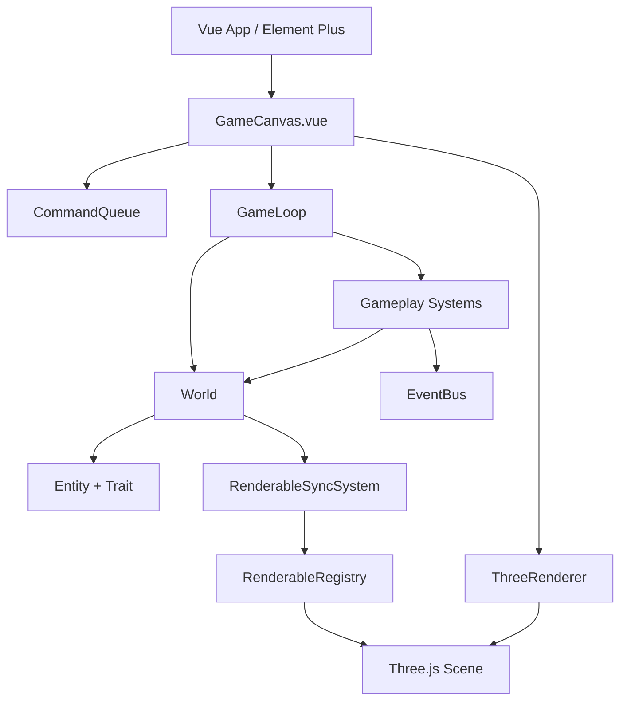

# 游戏引擎设计文档

## 1. 设计目标

本项目设计一个面向 RTS 扩展的 Web 3D 游戏引擎框架。短期用 `3D 坦克大战` 验证框架可行性，长期逐步扩展到红色警戒风格的 RTS 沙盒。

当前阶段的核心目标是：

- 让游戏逻辑脱离 Three.js，可以在 Node/Vitest 中独立测试。
- 用固定 tick 推进模拟，为回放、调试和未来联机同步保留基础。
- 用 `Entity + Trait + System` 组织玩法对象和系统逻辑。
- 用 `CommandQueue` 统一玩家输入、AI 决策和未来网络命令。
- 用 Vue 3 + Element Plus 负责页面、HUD、编辑器和调试面板。
- 用 Three.js 作为渲染适配层，而不是把渲染对象塞进核心逻辑。

## 2. 技术栈

- 前端框架：Vue 3
- UI 框架：Element Plus
- 构建工具：Vite
- 语言：TypeScript
- 3D 渲染：Three.js
- 测试：Vitest
- 状态管理预留：Pinia，后续用于 UI、编辑器和菜单状态，不承载核心模拟状态

## 3. 架构总览



核心原则：模拟层只表达游戏状态和规则；渲染层只读取模拟状态并同步视觉对象；Vue 层只负责页面交互和命令输入。

## 4. 模块职责

### 4.1 `src/engine`

`src/engine` 是渲染无关的核心引擎层。

- `core/GameLoop.ts`：以固定 tick 推进 `World` 和 `System`。
- `core/World.ts`：持有实体集合，管理实体创建、查询、删除和 trait 生命周期。
- `core/System.ts`：定义系统接口，每个系统在 tick 中处理一类跨实体逻辑。
- `entity/Entity.ts`：定义游戏实体结构。
- `entity/Trait.ts`：定义实体能力和状态片段。
- `entity/Transform.ts`：定义渲染无关的位置、旋转和缩放。
- `command/Command.ts`：定义输入意图。
- `command/CommandQueue.ts`：缓存命令，并按 tick 和系统筛选消费。
- `event/EventBus.ts`：提供系统间解耦事件通信。

### 4.2 `src/engine-three`

`src/engine-three` 是 Three.js 适配层。

- `renderer/ThreeRenderer.ts`：创建 `Scene`、`Camera`、`WebGLRenderer`、光照和基础地面。
- `renderer/RenderableRegistry.ts`：维护 `EntityId -> Object3D` 的映射。
- `renderer/RenderableSyncSystem.ts`：把实体 `Transform` 单向同步到 Three.js 对象。

该层可以依赖 `src/engine`，但 `src/engine` 不能反向依赖 Three.js。

### 4.3 `src/games/tank-battle`

`src/games/tank-battle` 是当前验证玩法。

- `traits/`：坦克、武器、生命、碰撞、炮弹等状态。
- `systems/`：坦克控制、炮弹、碰撞伤害等固定 tick 系统。
- `commands/`：坦克移动、瞄准、开火命令负载类型。
- `factory/createTankBattleWorld.ts`：创建当前硬编码测试战场。
- `render/createTankBattleRenderables.ts`：为坦克、目标、炮弹创建 Three.js 对象。
- `ui/TankBattleHud.vue`：用 Element Plus 显示生命值、炮弹数和目标数。

## 5. 固定 Tick 模拟

`GameLoop` 把不稳定的浏览器渲染帧转换为固定长度的模拟 tick。当前游戏使用 `30 tick/s`。

每个 tick 的顺序是：

1. `World.tick(context)` 调用实体 trait 的 `onTick` 钩子。
2. 依次执行系统列表。
3. 系统读取命令、修改实体状态、创建或删除实体。
4. 渲染同步系统把实体 transform 写入 Three.js 对象。

固定 tick 的价值：

- 游戏逻辑不受浏览器帧率影响。
- 单元测试可以手动推进时间。
- 未来可以做回放、确定性调试和 lockstep 联机。

## 6. 命令模型

命令表达“意图”，不直接修改状态。

```ts
interface Command<TPayload = unknown> {
  id: string
  actorId: EntityId
  type: string
  payload: TPayload
  tick?: number
}
```

当前坦克大战使用：

- `tank.move`：移动和转向输入。
- `tank.aim`：炮塔朝向输入，当前预留。
- `tank.fire`：开火请求。

`CommandQueue.dequeueForTick(currentTick, predicate)` 支持多个系统共享同一个队列。每个系统只消费自己认识的命令类型，未匹配命令会留在队列中，避免系统执行顺序导致命令丢失。

## 7. Entity / Trait / System

### Entity

实体是稳定 id、类型、transform 和 traits 的组合。实体本身尽量轻量，不承担复杂行为。

### Trait

Trait 是状态和能力片段，例如：

- `TankTrait`：移动速度、转向速度、炮塔朝向、当前输入。
- `WeaponTrait`：冷却、炮弹速度、伤害。
- `HealthTrait`：当前生命、最大生命、销毁标记。
- `ColliderTrait`：圆形碰撞半径。
- `ProjectileTrait`：炮弹所属者、伤害、速度、生命周期。

### System

System 处理跨实体规则，例如：

- `TankControlSystem`：消费移动/瞄准命令并推进坦克位姿。
- `ProjectileSystem`：消费开火命令、生成炮弹、推进炮弹位置、处理生命周期。
- `CollisionDamageSystem`：检测炮弹命中、扣血、删除炮弹和死亡目标。
- `RenderableSyncSystem`：同步渲染对象。

## 8. 渲染设计

渲染层通过 `RenderableRegistry` 找到实体对应的 Three.js 对象。

当前对象创建规则：

- `tank`：蓝色车体、炮塔和炮管组合。
- `target`：红色方块目标。
- `projectile`：黄色球体。

`createTankBattleRenderables` 在渲染帧中检查：

- World 中有实体但 registry 没有对象时，创建 Mesh/Group。
- Registry 中有对象但 World 中实体已删除时，移除 Three.js 对象。

这样 gameplay 系统只需要关心实体生命周期，不需要知道 Three.js 细节。

## 9. Vue 与引擎边界

Vue 负责：

- 页面路由。
- Element Plus 导航、HUD、后续编辑器面板。
- 键盘输入监听。
- 把输入转换为命令写入 `CommandQueue`。

Vue 不应该：

- 直接修改实体内部状态来实现玩法。
- 在核心模拟逻辑中传递 `Mesh`、`Scene`、`Camera` 等 Three.js 类型。
- 把胜负判断、伤害计算、AI 行为写进组件。

## 10. 当前坦克大战运行流程

```mermaid
sequenceDiagram
  participant User as 玩家
  participant Vue as GameCanvas.vue
  participant Queue as CommandQueue
  participant Loop as GameLoop
  participant Tank as TankControlSystem
  participant Projectile as ProjectileSystem
  participant Collision as CollisionDamageSystem
  participant Render as RenderableSyncSystem

  User->>Vue: 按 W/A/S/D/Space
  Vue->>Queue: 写入 tank.move 或 tank.fire
  Loop->>Tank: 固定 tick 更新
  Tank->>Queue: 消费移动命令
  Tank->>Tank: 更新坦克位置和朝向
  Loop->>Projectile: 固定 tick 更新
  Projectile->>Queue: 消费开火命令
  Projectile->>Projectile: 生成/移动/过期炮弹
  Loop->>Collision: 固定 tick 更新
  Collision->>Collision: 命中检测、扣血、删除实体
  Loop->>Render: 同步 Transform 到 Object3D
```

## 11. 自动测试策略

当前测试使用 Vitest，重点测试核心逻辑，不依赖浏览器。

已有覆盖：

- `World`：实体生命周期和 trait 钩子。
- `CommandQueue`：按 tick、按系统筛选消费命令。
- `GameLoop`：固定 tick 推进、停止调度、浏览器 frame scheduler 绑定。
- `EventBus`：订阅、派发、取消订阅。
- `RenderableSyncSystem`：实体 transform 同步。
- `TankControlSystem`：移动和转向。
- `ProjectileSystem`：开火、炮弹移动、生命周期。
- `CollisionDamageSystem`：命中、扣血、目标销毁。

提交前应运行：

```bash
npm run verify
```

## 12. 扩展路线

后续建议按以下顺序推进：

1. 人机对战：`TeamTrait`、`BotTrait`、AI 状态机、胜负判断。
2. 关卡数据：Level JSON schema、加载器、校验器、运行时构建器。
3. 地图/关卡编辑器：Element Plus 工具栏、属性面板、保存/加载 JSON、一键试玩。
4. RTS 操作层：框选、多单位命令、右键移动/攻击、RTS 相机。
5. 地图与寻路：网格占用、A*、动态阻挡、多单位避让。
6. 经济与生产：资源、采集、建造、生产队列、科技前置。
7. 确定性与回放：命令日志、状态 hash、确定性随机数、回放调试。

## 13. 设计约束

- 核心模拟层不得依赖 Three.js。
- 玩法系统通过命令、World、Trait 和事件通信。
- UI 使用 Element Plus，不另造基础 UI 控件体系。
- 新增核心玩法逻辑前先写 Vitest 测试。
- 修复玩法 bug 前先补能复现问题的测试。
- 调试输出和临时产物放到 `.artifacts/`，不要提交。
