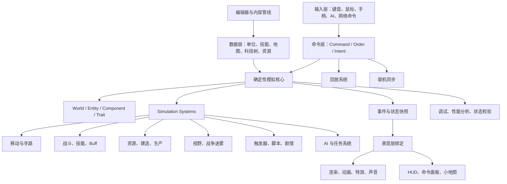

# 工业级 RTS 游戏引擎分析、对比与演进计划

## 1. 文档目标

本文单独说明工业级 RTS 游戏引擎通常是什么样的，并以《星际争霸 2》《魔兽争霸 3》这类成熟 RTS 产品作为参照，分析当前项目与工业级引擎之间的差距，制定后续演进路线和需要补充的知识体系。

需要先说明边界：`StarCraft II` 和 `Warcraft III` 的完整引擎源码不是公开资料。本文不会假装知道它们的私有源码实现，而是基于公开可观察的游戏能力、编辑器能力、RTS 工程通用模式、以及类似 OpenRA、0 A.D. 等可研究项目总结工业级 RTS 引擎应具备的结构。

## 2. 工业级 RTS 引擎不是一个渲染器

工业级 RTS 引擎的核心不是“能把单位画出来”，而是一个长期可扩展的实时战争模拟平台。它通常包含：

- 确定性模拟核心。
- 命令系统。
- 单位、建筑、技能、武器、Buff、阵营等游戏对象模型。
- 地图、地形、寻路、碰撞、视野和战争迷雾。
- AI、任务、触发器、剧情脚本。
- 资源、建造、生产、科技树。
- 联机同步、回放、观战。
- 编辑器和数据管线。
- 调试、性能分析、自动测试和内容校验工具。
- 渲染、动画、特效、声音、UI、输入等表现层系统。

因此，工业级 RTS 引擎更像一个“游戏操作系统”：渲染只是其中一层，真正难的是长期维护模拟一致性、内容生产效率、调试能力和复杂系统之间的边界。

## 3. 星际争霸 2、魔兽争霸 3 这类 RTS 引擎的典型特征

### 3.1 数据驱动程度很高

《魔兽争霸 3》的 World Editor 和 Object Editor 让地图作者可以配置单位、技能、物品、科技、触发器。《星际争霸 2》的 Galaxy Editor / Data Editor 更进一步，把单位、Actor、Effect、Behavior、Validator、Ability 等拆成大量数据对象。

这说明工业级 RTS 引擎不会把所有玩法写死在代码里，而是把大量规则放进数据层：

- 单位属性。
- 武器属性。
- 技能效果。
- Buff / 行为。
- 模型和特效绑定。
- 科技树。
- 按钮、命令卡、UI 表现。
- 地图触发器和剧情逻辑。

代码负责解释和执行这些数据，编辑器负责生产和校验这些数据。

### 3.2 模拟层高度独立

RTS 需要支持大量单位同时行动，还要支持联机、回放和观战。工业级 RTS 通常会把核心模拟做成相对独立的层。

模拟层负责：

- 单位状态。
- 移动、攻击、技能。
- 冷却、生命、护盾、能量。
- 资源采集。
- 生产队列。
- 可见性。
- 触发器执行。
- 胜负条件。

渲染层负责把模拟层状态表现出来。UI 层负责给玩家输入和展示信息。网络层负责同步玩家命令或状态。它们不能随意反向污染模拟层。

### 3.3 命令驱动和回放能力是核心能力

RTS 游戏的回放通常不是录视频，而是记录玩家命令、随机种子、版本信息和必要同步数据，然后重新跑一遍模拟。

这要求引擎具备：

- 命令模型。
- 固定 tick 或稳定的模拟步进。
- 确定性随机数。
- 可重复执行的系统顺序。
- 状态校验或 hash。
- 版本兼容策略。

当前项目已经有 `CommandQueue` 和固定 tick，这是正确方向，但距离工业级回放还缺少确定性随机、状态 hash、命令日志、版本化数据等能力。

### 3.4 地图和路径系统是 RTS 的核心

RTS 的地面不是普通 3D 场景，而是带有 gameplay 语义的地图：

- 哪些格子可以走。
- 哪些区域被建筑占用。
- 哪些地形影响移动速度。
- 哪些区域可飞行不可地面通行。
- 哪些区域被战争迷雾遮挡。
- 哪些位置可以建造。
- 哪些路径会被动态阻挡。

寻路也不只是 A*：

- 大地图路径。
- 局部避障。
- 单位半径。
- 编队移动。
- 单位拥挤处理。
- 动态阻挡重规划。
- 飞行单位和地面单位分层。
- 建筑放置占用更新。

工业级 RTS 在地图与寻路上的工程量通常远大于第一眼想象。

### 3.5 编辑器是引擎的一部分

《魔兽争霸 3》和《星际争霸 2》的生命力很大程度来自编辑器。工业级 RTS 引擎不能只服务程序员，还要服务关卡设计、美术、策划和 MOD 作者。

编辑器通常需要：

- 地形编辑。
- 单位、建筑、资源点放置。
- 出生点、区域、路径点。
- 触发器编辑。
- 对象数据编辑。
- 脚本和事件系统。
- 校验和错误提示。
- 一键运行当前地图。
- 内容打包和版本管理。

当前项目计划中的地图/关卡编辑器是正确方向，但未来不能只做“摆几个方块”，必须逐步变成内容生产工具链。

### 3.6 表现层和模拟层通常通过中间绑定关联

《星际争霸 2》这类引擎里，单位的逻辑对象和视觉 Actor 通常不是同一个对象。逻辑单位负责血量、技能、命令和碰撞；视觉 Actor 负责模型、动画、特效、声音和 UI 表现。

当前项目里的 `Entity` 与 `RenderableRegistry` 也是类似思路：

- `Entity` 是模拟对象。
- `Object3D` 是渲染对象。
- `RenderableSyncSystem` 把模拟 transform 同步到渲染对象。

后续要继续沿着这个方向扩展，而不是把 Three.js Mesh 直接塞进玩法系统。

## 4. 工业级 RTS 引擎的典型架构



从这个视角看，工业级 RTS 引擎的关键不是某个类写得多复杂，而是这些子系统有清晰边界，并且可以在多年内容扩展中保持可测试、可调试、可维护。

## 5. 当前项目与工业级 RTS 引擎对比

| 能力 | 当前项目状态 | 工业级 RTS 引擎状态 | 差距 |
| --- | --- | --- | --- |
| 固定 tick | 已有 `GameLoop` | 稳定模拟、回放、联机同步基础 | 缺确定性随机、状态 hash、命令日志 |
| 命令系统 | 已有 `CommandQueue` | 玩家、AI、网络、回放统一命令模型 | 缺 Order/Activity/Task 分层 |
| Entity/Trait | 已有基础组合模型 | 大量组件、数据驱动对象、动态行为组合 | 缺配置化、生命周期事件、能力系统 |
| System | 已有移动、炮弹、碰撞伤害 | 大量可组合模拟系统 | 当前系统数量少，职责还偏 MVP |
| 渲染分离 | 已有 `RenderableRegistry` 和同步系统 | 逻辑对象与 Actor/表现对象强分离 | 缺动画、特效、声音、LOD、资源加载 |
| 地图 | 只有硬编码场景 | 地形、格子、区域、阻挡、资源点、出生点 | 缺 Level JSON、地图语义、校验器 |
| 寻路 | 未实现 | 分层寻路、局部避障、编队移动 | 缺网格、A*、动态阻挡 |
| AI | 未实现 | 战斗 AI、经济 AI、脚本 AI、任务 AI | 缺状态机、感知、决策、命令输出 |
| 战斗系统 | 有炮弹、碰撞、伤害 | 武器、护甲、技能、Buff、弹道、范围伤害 | 缺伤害类型、护甲、技能、效果链 |
| 经济生产 | 未实现 | 资源、采集、建造、生产队列、科技树 | 完全缺失 |
| 视野迷雾 | 未实现 | 单位视野、队伍共享、战争迷雾、小地图 | 完全缺失 |
| 编辑器 | 占位页面 | 地图、对象、触发器、数据编辑器 | 缺完整内容生产链 |
| 自动测试 | 有核心 Vitest | 单元、集成、回放、编辑器、性能基线 | 缺长流程 smoke/debug 和性能回归 |
| 工具链 | 基础 npm scripts | 内容校验、调试面板、性能分析、资源打包 | 缺工程化工具 |

结论：当前项目已经具备“工业级 RTS 的正确骨架方向”，但还处于非常早期的 vertical slice 阶段。它证明了固定 tick、命令、World、Trait、System、渲染分离这条路可行，但还没有形成 RTS 引擎的内容系统、地图系统、AI 系统和工具链。

## 6. 当前项目最应该坚持的方向

### 6.1 保持模拟层纯净

不能为了短期方便把 Three.js、Vue、DOM、Element Plus 引入 `src/engine`。这是后续能否测试、回放、联机的分水岭。

### 6.2 让 AI 和玩家共用命令系统

AI 不应该直接移动单位或创建炮弹。AI 应该读取 World，产生命令，再由现有系统执行命令。

正确方向：

```text
BotAiSystem -> CommandQueue -> TankControlSystem / ProjectileSystem
```

错误方向：

```text
BotAiSystem -> 直接修改 transform / 直接 spawn projectile
```

### 6.3 尽快从硬编码世界升级到 Level JSON

硬编码世界只能验证引擎。想变成 RTS 引擎，必须有数据驱动的地图和单位创建。

当前：

```text
createTankBattleWorld.ts 写死 player 和 target
```

目标：

```text
level.json -> LevelLoader -> MapValidator -> LevelRuntimeBuilder -> World
```

### 6.4 编辑器必须服务运行时

编辑器不能是展示页面。它产出的 JSON 必须能被运行时直接加载，并且能一键试玩。

如果编辑器和运行时各用一套数据结构，项目会很快失控。

## 7. 演进计划

### 阶段 A：人机对战最小闭环

目标：让当前坦克大战从“打靶”变成“玩家 vs AI”。

新增模块：

- `TeamTrait`
- `BotTrait`
- `BotAiSystem`
- `WinConditionSystem`
- `MatchState`

核心设计：

- AI 读取 World 和玩家位置。
- AI 有简单状态机：`patrol -> chase -> attack`。
- AI 只写命令，不直接改实体。
- 胜负判断独立成系统。

验收标准：

- 玩家可以和 AI 互相开火。
- AI 能发现、追击、攻击玩家。
- 玩家击毁所有 AI 后胜利。
- 玩家死亡后失败。
- AI 状态机和胜负条件有 Vitest 测试。

### 阶段 B：Level JSON 与地图语义

目标：让场景从硬编码升级为数据驱动。

新增模块：

- `LevelSchema`
- `LevelLoader`
- `MapValidator`
- `LevelRuntimeBuilder`
- 示例关卡 JSON

Level JSON 至少包含：

- 地图尺寸。
- 地面格子。
- 阻挡物。
- 玩家出生点。
- AI 出生点。
- 巡逻点。
- 初始单位。
- 胜负条件。

验收标准：

- 示例关卡能从 JSON 加载。
- 错误关卡能给出明确校验错误。
- 运行时只通过 `LevelRuntimeBuilder` 创建 World。
- 保存/加载结构为后续编辑器复用。

### 阶段 C：地图与关卡编辑器 MVP

目标：做出真正能生产关卡的编辑器。

新增能力：

- 新建地图。
- 设置地图尺寸。
- 放置障碍物。
- 放置玩家出生点。
- 放置 AI 出生点。
- 放置敌方坦克。
- 设置巡逻点。
- 选择对象并编辑属性。
- 保存 JSON。
- 加载 JSON。
- 一键试玩当前关卡。

技术要求：

- UI 使用 Element Plus。
- 编辑器状态不要直接复用运行时 World。
- 保存前必须走 `MapValidator`。
- 一键试玩必须走 `LevelRuntimeBuilder`。

验收标准：

- 编辑器产出的 JSON 可以被游戏页加载。
- 保存后再加载，数据一致。
- 编辑器有基础 smoke/debug 验证。

### 阶段 D：RTS 操作层

目标：从单坦克操作转向 RTS 操作方式。

新增能力：

- 俯视 RTS 相机。
- 鼠标框选单位。
- 多单位选择状态。
- 右键移动。
- 右键攻击。
- 命令队列。
- 简单队形。

架构重点：

- 引入 `SelectionState`，但不要把选择状态塞进核心实体。
- 玩家操作生成 `MoveToCommand`、`AttackCommand`。
- 单位执行命令时进入 task/activity 状态。

验收标准：

- 可以框选多个单位。
- 可以给多个单位下移动命令。
- 可以右键攻击目标。
- 多单位命令和单单位命令共用命令系统。

### 阶段 E：寻路和空间系统

目标：让单位能在地图中合理移动。

新增模块：

- `GridMap`
- `OccupancyMap`
- `Pathfinder`
- `PathRequestSystem`
- `MovementIntentSystem`
- `LocalAvoidanceSystem`

知识重点：

- A*。
- 路径平滑。
- 动态阻挡。
- 单位半径。
- 局部避障。
- 编队移动。

验收标准：

- 单位能绕开障碍物。
- 多单位移动不会完全重叠。
- 建筑占用会影响路径。
- 寻路有单元测试和典型地图用例。

### 阶段 F：数据驱动单位、武器和技能

目标：把坦克、武器、技能从代码中抽出来。

新增数据：

- `units.json`
- `weapons.json`
- `abilities.json`
- `effects.json`
- `actors.json`

推荐模型：

```text
Ability -> Effect -> Modifier / Damage / SpawnProjectile / ApplyBuff
Actor -> Model / Animation / VFX / Sound
Unit -> Traits / Abilities / Weapons / ActorRef
```

验收标准：

- 新增一种坦克不需要改系统代码。
- 新增一种武器不需要改系统代码。
- 技能效果可以组合。
- 数据校验能发现缺失引用和非法参数。

### 阶段 G：资源、建造、生产和科技树

目标：进入真正 RTS 核心玩法。

新增系统：

- 资源系统。
- 采集系统。
- 建造系统。
- 生产队列。
- 科技树。
- 建筑占用。
- 命令面板。

验收标准：

- 工人采集资源。
- 建筑可以生产单位。
- 科技前置能限制单位生产。
- UI 命令面板从数据生成。

### 阶段 H：战争迷雾、小地图和回放

目标：补齐 RTS 体验和工程验证能力。

新增能力：

- 单位视野。
- 队伍共享视野。
- 战争迷雾。
- 小地图。
- 命令日志。
- 状态 hash。
- 回放系统。

验收标准：

- 不在视野内的敌人不可见。
- 小地图显示可见区域和单位。
- 一局游戏可以通过命令日志回放。
- 回放结果与原局状态 hash 一致。

## 8. 当前项目与工业级路线的优先级

如果只看“最该先补什么”，建议顺序是：

1. `TeamTrait + BotAiSystem + WinConditionSystem`
2. `Level JSON + MapValidator + LevelRuntimeBuilder`
3. `MapEditor MVP`
4. `GridMap + A* Pathfinder`
5. `RTS selection + MoveToCommand + AttackCommand`
6. `Data-driven Unit/Weapon/Ability`
7. `Fog of War + Minimap`
8. `Replay + State Hash`

原因：

- 先补 AI 和胜负，能让当前坦克大战变成真正游戏。
- 再补 Level JSON，能把硬编码世界拆掉。
- 再补编辑器，能建立内容生产链。
- 再补寻路和 RTS 操作，才进入真正 RTS。
- 数据驱动和回放要建立在前面基础上，否则容易设计空转。

## 9. 需要学习补充的知识

### 9.1 游戏循环与确定性模拟

需要掌握：

- 固定 tick。
- 变帧率渲染。
- 插值渲染。
- 浮点数确定性风险。
- 随机数种子。
- 状态 hash。
- 回放系统。

建议学习：

- `Fix Your Timestep!`
- `Game Programming Patterns` 中的 Game Loop、Update Method、Command、Event Queue。

### 9.2 ECS / Actor / Trait 架构

需要掌握：

- Entity/Component/System。
- Actor/Trait 模型。
- 组合优于继承。
- 组件生命周期。
- 系统执行顺序。
- 数据驱动组件创建。

建议研究：

- OpenRA 的 Actor、Trait、Order、Activity、World、Rules、Map。
- 0 A.D. 的组件和模拟系统。

### 9.3 RTS 命令与任务系统

需要掌握：

- Command / Order / Task / Activity 的区别。
- 玩家命令和 AI 命令统一入口。
- 命令队列。
- 目标选择。
- 右键上下文命令。
- 多单位命令分发。

实践目标：

- 从 `tank.move`、`tank.fire` 演进到 `move-to`、`attack`、`attack-move`、`patrol`、`hold-position`。

### 9.4 地图、网格和寻路

需要掌握：

- Grid map。
- Tile map。
- A*。
- 启发函数。
- 路径平滑。
- 动态阻挡。
- 局部避障。
- 编队移动。
- flow field。

建议学习：

- Red Blob Games 的网格和 A* 系列。
- RTS 中分层寻路和局部避障案例。

### 9.5 战斗、技能和效果系统

需要掌握：

- 武器系统。
- 伤害类型。
- 护甲类型。
- 投射物。
- 范围伤害。
- Buff / Debuff。
- 技能目标类型。
- 效果链。
- 冷却和资源消耗。

建议参考《星际争霸 2》数据编辑器思路：

```text
Ability -> Effect -> Behavior / Damage / Search / Apply
```

不要一开始就全做，但要理解这种拆分方式。

### 9.6 编辑器和内容管线

需要掌握：

- JSON schema。
- 数据校验。
- 引用校验。
- 关卡保存/加载。
- 编辑器状态与运行时状态分离。
- 一键试玩。
- 内容版本迁移。

实践目标：

- 先做地图编辑器，再做单位/武器数据编辑器。

### 9.7 渲染、动画和表现层绑定

需要掌握：

- Three.js 场景管理。
- glTF 模型加载。
- 动画状态机。
- 粒子和特效。
- 贴花、选中圈、血条。
- 小地图渲染。
- 性能分析。

架构重点：

- 表现层对象不要变成模拟对象。
- 模拟事件驱动特效，但特效不反向决定模拟结果。

### 9.8 自动测试和调试工具

需要掌握：

- 核心逻辑单元测试。
- 系统集成测试。
- 回放测试。
- 状态快照。
- 性能基线。
- Debug overlay。
- 命令日志。
- 地图校验报告。

实践目标：

- 每个阶段都保留 `npm run verify`。
- 增加 `debug:tank-battle` 和 `debug:level-editor`。
- `.artifacts/` 输出状态 JSON 和截图。

## 10. 推荐学习顺序

### 第一阶段：打牢当前引擎核心

目标：理解当前代码为什么这样写。

学习内容：

- 固定 tick。
- Entity/Trait/System。
- CommandQueue。
- Three.js 渲染同步。
- Vitest 系统测试。

实践任务：

- 给当前坦克大战补 `TeamTrait`。
- 写 `BotAiSystem` 的最小状态机测试。
- 增加胜负条件系统。

### 第二阶段：补 RTS 基础

目标：从坦克大战过渡到 RTS 操作。

学习内容：

- A*。
- 网格地图。
- 单位选择。
- 多单位命令。
- Order/Activity 模型。

实践任务：

- 实现 `MoveToCommand`。
- 实现网格地图和简单 A*。
- 实现鼠标框选和右键移动。

### 第三阶段：补工业级内容管线

目标：理解为什么编辑器是引擎的一部分。

学习内容：

- JSON schema。
- 数据驱动单位。
- 地图编辑器。
- 数据校验和错误报告。

实践任务：

- 实现 `LevelLoader`。
- 实现 `MapValidator`。
- 实现地图编辑器 MVP。
- 编辑器一键试玩当前地图。

### 第四阶段：补复杂 RTS 系统

目标：接近红色警戒类 RTS 的核心结构。

学习内容：

- 技能系统。
- 资源系统。
- 建造系统。
- 科技树。
- 战争迷雾。
- 回放。

实践任务：

- 数据驱动武器和单位。
- 工人采集资源。
- 建筑生产单位。
- 小地图和战争迷雾。
- 命令回放和状态 hash。

## 11. 面向本项目的 12 周演进建议

### 第 1-2 周：人机对战

- 实现 `TeamTrait`。
- 实现 `BotTrait`。
- 实现 `BotAiSystem`。
- 实现 `WinConditionSystem`。
- 增加 AI 和胜负测试。

产出：可以玩的玩家 vs AI 坦克大战。

### 第 3-4 周：关卡 JSON

- 设计 `LevelSchema`。
- 实现 `LevelLoader`。
- 实现 `MapValidator`。
- 实现 `LevelRuntimeBuilder`。
- 用 JSON 替代硬编码战场。

产出：可以从 JSON 加载关卡。

### 第 5-6 周：地图编辑器 MVP

- 实现 Element Plus 编辑器布局。
- 放置障碍物、出生点、敌人。
- 保存/加载 JSON。
- 一键试玩。

产出：能生产可运行关卡的编辑器。

### 第 7-8 周：寻路与 RTS 操作

- 实现网格地图。
- 实现 A*。
- 实现鼠标选择。
- 实现右键移动。
- 实现多单位移动命令。

产出：开始具备 RTS 操作形态。

### 第 9-10 周：数据驱动单位和武器

- 实现 `units.json`。
- 实现 `weapons.json`。
- 实现数据校验。
- 从数据创建 Trait。

产出：新增单位和武器不需要改系统代码。

### 第 11-12 周：调试、回放与工程化

- 实现命令日志。
- 实现状态快照。
- 实现 `debug:tank-battle`。
- 实现基础 replay 原型。
- 增加性能和实体数量统计。

产出：项目开始具备长期开发所需的调试能力。

## 12. 判断是否走向工业级的标准

一个 RTS 项目是否开始接近工业级，不看画面是否华丽，而看这些问题能否回答：

- 新增一个单位是否只改数据，不改系统代码？
- 地图是否能由编辑器生产，并被运行时直接加载？
- AI 是否通过命令系统行动，而不是绕过玩法系统？
- 能否回放一局游戏？
- 一次 bug 是否能通过测试或回放复现？
- 核心模拟是否能在无浏览器环境测试？
- 渲染对象是否不会污染模拟层？
- 内容错误是否能在保存或构建阶段发现？
- 性能问题是否有指标，而不是靠肉眼感觉？

当前项目已经回答了其中一部分：

- 核心模拟能无浏览器测试。
- 渲染对象没有进入模拟层。
- 玩家输入已经走命令队列。
- 固定 tick 已建立。

还没有回答的关键问题：

- 数据驱动内容。
- 编辑器生产链。
- AI 与胜负。
- 寻路和 RTS 操作。
- 回放和状态校验。
- 性能和调试工具。

## 13. 结论

当前项目不是工业级 RTS 引擎，但它的第一层架构方向是正确的：固定 tick、命令驱动、Entity/Trait/System、模拟与渲染分离、Vitest 测试。

下一步不要急着做复杂画面，也不要急着复刻红色警戒全部系统。更合理的路线是：

1. 先把坦克大战做成真正的人机对战。
2. 再把硬编码世界改成 Level JSON。
3. 再做能生产 Level JSON 的地图编辑器。
4. 再补 RTS 操作、寻路和数据驱动。
5. 最后再进入资源、生产、战争迷雾和回放。

这样走，项目会逐步从“可玩的 Three.js demo”演进成“有工业级 RTS 引擎形态的长期工程”。
